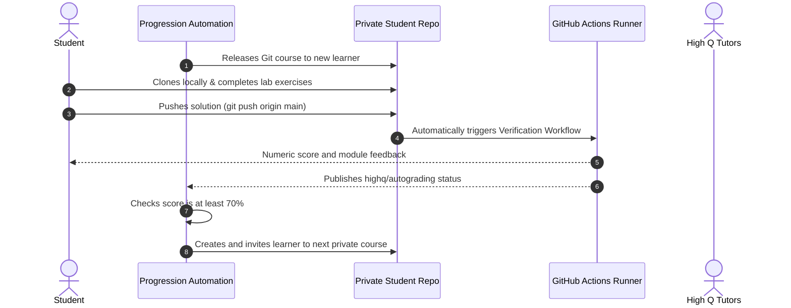

# 🌟 High Q Solid Academy Limited

### *"Always Ahead of Others"*

  

  <b>📍 Ikorodu, Lagos, Nigeria &nbsp;|&nbsp; 🎓 Mentoring 1000+ Future Tech Leaders & Scholars &nbsp;|&nbsp; ⚡ Since 2018</b>

---

## 💡 About High Q Solid Academy

**High Q Solid Academy Limited** is an academic tutorial centre, digital skills institute, and **NYSC Accredited Centre** located in Ikorodu, Lagos, Nigeria. Founded under the leadership of **Master Adebule Quam**, the academy is driven by the philosophy that:

> *"Education is the force to push one ahead of others. Our unwavering commitment is to ensure every student achieves academic excellence and develops the practical confidence to face real-world challenges."*
> — **Master Adebule Quam**, CEO & Lead Tutor

Through our **Digital Skills & Web Development Division**, we equip students with world-class software engineering skills. Every course in this organization features **automated GitHub Actions grading and verification workflows** so students get instant feedback on their code submissions just like in top engineering teams.

---

## 📊 Academy Highlights

| 🏆 Academic & Tech Metric | Track Record |
| :--- | :--- |
| **WAEC / NECO Success Rate** | **98%** Distinction & Credit rate |
| **Top JAMB / UTME Score** | **305** (2025/2026 Academic Season) |
| **Students Mentored** | **1,000+** Scholars & Developers |
| **Tech & Digital Placement** | **75%** Placement into higher degrees & digital roles |
| **Accreditation** | **NYSC Accredited Centre** |

---

## 🚀 Full-Stack Web Development & Software Engineering Curriculum

Our locked 11-course program takes a complete beginner from the first terminal command through full-stack engineering, responsible AI and defensive security. Each private course is released only after the learner reaches the 70% pass mark in its prerequisite.

```mermaid
graph LR
    T1["01. Git & GitHub"] --> T2["02. HTML5"]
    T2 --> T3["03. CSS3 + Bootstrap + Tailwind"]
    T3 --> T4["04. JavaScript ES6+"]
    T4 --> T5["05. PHP & MySQL"]
    T5 --> T6["06. Python Automation"]
    T6 --> T7["07. React.js"]
    T7 --> T8["08. React + TypeScript"]
    T8 --> T9["09. Node.js + Express"]
    T9 --> T10["10. AI + Prompt Engineering"]
    T10 --> T11["11. Security + Vulnerabilities"]
```

### 📚 Course Repositories & Verification Engines

| Track | Repository | Key Topics | Automated CI/CD Grader |
| :--- | :--- | :--- | :--- |
| **01. Git & GitHub** | [`course-git-github`](https://github.com/High-Q-Solid-Academy/course-git-github) | Terminal, commits, branches, merge conflicts, PRs | Conventional commit linting & PR compliance action |
| **02. HTML Foundations** | [`course-html-foundations`](https://github.com/High-Q-Solid-Academy/course-html-foundations) | Semantic tags, accessible forms, tables, SEO meta | Headless DOM & W3C validation tests |
| **03. CSS, Bootstrap & Tailwind** | [`course-css-mastery`](https://github.com/High-Q-Solid-Academy/course-css-mastery) | CSS, Flexbox, Grid, Bootstrap 5, Tailwind CSS | Responsive framework and layout assertions |
| **04. JavaScript Core** | [`course-javascript-core`](https://github.com/High-Q-Solid-Academy/course-javascript-core) | ES6+, arrays/objects, DOM manipulation, Async/Fetch | Vitest test suite with instant score reports |
| **05. PHP & MySQL** | [`course-php-backend`](https://github.com/High-Q-Solid-Academy/course-php-backend) | PHP 8, PDO, SQL CRUD, JSON APIs, session auth | PHP backend verification test runner |
| **06. Python Automation** | [`course-python-automation`](https://github.com/High-Q-Solid-Academy/course-python-automation) | Python syntax, collections, files, safe automation | Executable Python behavior tests |
| **07. React.js Mastery** | [`course-reactjs-mastery`](https://github.com/High-Q-Solid-Academy/course-reactjs-mastery) | JSX, components, state, Hooks, SPAs | React component assertion runner |
| **08. React with TypeScript** | [`course-react-ts-enterprise`](https://github.com/High-Q-Solid-Academy/course-react-ts-enterprise) | Interfaces, unions, typed props, API contracts | Type-contract verification runner |
| **09. Node.js & Express** | [`course-nodejs-backend`](https://github.com/High-Q-Solid-Academy/course-nodejs-backend) | Express, middleware, REST APIs, authentication | Executable backend behavior tests |
| **10. AI & Prompt Engineering** | [`course-ai-prompt-engineering`](https://github.com/High-Q-Solid-Academy/course-ai-prompt-engineering) | Prompt structure, evaluation, privacy, responsible AI | Evidence and rubric verification |
| **11. Security & Vulnerabilities** | [`course-security-vulnerabilities`](https://github.com/High-Q-Solid-Academy/course-security-vulnerabilities) | Threat modeling, OWASP risks, auth, disclosure | Defensive-analysis rubric verification |

---

## 🎓 How Learning Works (Template & Real-World Portfolio Workflow)

### The learner workflow

1. **Accept the invitation:** The learner receives access only to the currently unlocked private course repository.
2. **Learn, code and push:** Read the beginner notes, follow the guided video index, complete the exercises and push commits.
3. **Use the feedback:** GitHub Actions returns a numeric grade and a module-by-module report after every push.
4. **Advance after passing:** At 70% or higher, automation creates the next private course repository and sends a new collaborator invitation.

---

## 🛠 Tech Stack & Tools

---

## 🏢 Contact & Campus Locations

- 🌐 **Website**: [highqsolidacademy.com](https://highqsolidacademy.com)
- 📞 **Phone / WhatsApp**: [+234 807 208 8794](tel:+2348072088794)
- ✉️ **Email**: [highqsol@highqsolidacademy.com](mailto:highqsol@highqsolidacademy.com)
- 📍 **Tutorial Centre**: 8 Pineapple Avenue, Aiyetoro, Ikorodu North LCDA, Maya, Ikorodu, Lagos State
- 🏢 **Area Office**: Shop 3, 17, 18, World Star Complex, Opposite London Street, Aiyetoro Maya, Ikorodu, Lagos State
- ⏰ **Hours**: Mon – Fri: 8:00 AM – 6:00 PM | Sat: 9:00 AM – 4:00 PM

---

  © 2026 High Q Solid Academy Limited. Empowering the leaders of tomorrow.

